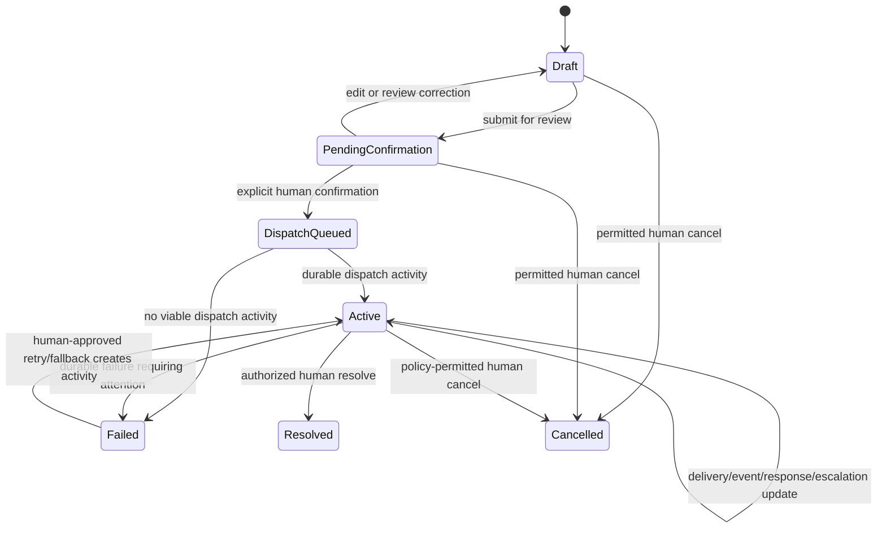

# Alert State Machine

Status: Phase 7 simulation dispatch implementation over the Phase 0 state and transition contract. It does not define a hospital's clinical escalation or resolution policy.

## Alert lifecycle states

The alert lifecycle state is separate from recipient delivery and response state.

| State | Meaning | Entry control |
|---|---|---|
| `Draft` | Editable typed source, SBAR content, and later recipient-selection work. | Human operator creates or edits. |
| `PendingConfirmation` | A complete draft is awaiting the later human review/confirmation phase. | Server validates required fields and critical values. |
| `DispatchQueued` | Exact version and recipients were explicitly confirmed and a durable dispatch request exists. | Authenticated human confirmation transaction only. |
| `Active` | Dispatch/response workflow is in progress or has durable activity. | Worker records delivery work/activity. |
| `Resolved` | An authorized human recorded the approved resolution outcome. | Production condition is `REQUIRES_HOSPITAL_DECISION`; simulation requires explicit test action. |
| `Cancelled` | An authorized human recorded cancellation where policy permits. | Permission and timing are `REQUIRES_HOSPITAL_DECISION`. |
| `Failed` | Durable failure requires operator attention or approved fallback. | Server/worker records a failure; it must not disappear. |

## Candidate transition diagram

The diagram shows possible simulation transitions, not permission to infer a production policy. Whether a transition is allowed, who may perform it, and which event is sufficient are `REQUIRES_HOSPITAL_DECISION` unless explicitly stated as a simulation-only fixture.

## Phase 2 implementation mapping

Phase 2 persists the Phase 0 lifecycle states above. Names used in some later summaries map as follows and are not extra production states:

| Later summary name | Phase 2 persistence |
|---|---|
| AwaitingConfirmation | `PendingConfirmation` |
| Approved | Confirmation metadata on a specific draft version; the lifecycle state becomes `DispatchQueued` |
| Dispatching / Dispatched | `DispatchQueued` then `Active` |
| Delivered, Acknowledged, Accepted | Recipient delivery and response records, not alert lifecycle states |

## Phase 5 drafting boundary

Phase 5 exposes only typed simulation draft creation/editing, protected source and SBAR storage, optimistic draft-version checks, critical-field confirmation, and submission to `PendingConfirmation`. Source and SBAR text must carry the `SIMULATION:` marker; patient references remain `SIM-` values. Critical fields are unresolved until an authenticated human confirms the exact value and unit.

The Phase 5 API does not select recipients, confirm dispatch, create outbox work, call providers, or run escalation. Those are later phases and remain unavailable.

## Phase 7 dispatch boundary

Phase 6 confirmation is the only entry into `DispatchQueued`. Phase 7 may move a confirmed alert to `Active` only after a durable simulation delivery attempt is recorded. The worker does not create a recipient, alter the approved version, infer a role, or select a new channel. It records delivery attempts and normalized synthetic provider events separately from opened, acknowledged, and responsibility-accepted states. A completed simulation delivery does not resolve the alert, and an outage or invalid dispatch remains visible as `Failed` or queued retry activity.

## Dispatch confirmation invariant

The server may enter `DispatchQueued` only when all of the following are true:

- The caller is authenticated and authorized for the organization.
- The request names the exact current draft version.
- Required source/template fields are present according to the approved template.
- Every required critical number and unit is explicitly confirmed by a human for that version.
- The approved message is the exact message shown in the review screen.
- Every recipient and channel is explicitly present in the request and persisted.
- Recipients are manually selected, active, and sufficiently disambiguated.
- The referenced notification and escalation policy versions are durable.
- The operation is idempotent and protected by optimistic concurrency.
- The approval, state transition, audit event, recipients, and `AlertDispatchRequested` outbox record commit atomically.

Editing any source, structured approved field, critical value/unit, urgency, recipient, channel, or policy reference increments the draft version and invalidates the prior approval.

## Delivery and response dimensions

For each recipient and channel, record separate states such as:

`requested`, `submitted/accepted by provider`, `delivered`, `failed`, and provider-event metadata.

For every supported delivery state, distinguish `Pending/NotObserved`, `Occurred`, and `Failed`. If the channel cannot produce that state, record `NotApplicable`. Never infer `Opened`, `Acknowledged`, or responsibility acceptance from delivery alone.

For each recipient, record separately:

`opened`, `acknowledged`, `responsibility accepted`, `declined`, and `unavailable`.

These are not interchangeable:

- `submitted` is not `delivered`.
- `delivered` is not `opened`.
- `opened` is not `acknowledged`.
- `acknowledged` is not responsibility accepted.
- Responsibility accepted does not silently resolve the alert.

## Escalation invariant

Escalation evaluates the approved policy version captured at confirmation using durable UTC/database time. It may create further work only according to that policy. AI output, a browser timer, provider callback text, or an unreviewed directory change cannot change or stop escalation.

The trigger, delay, retry limit, stop condition, backup hierarchy, override, and manual fallback are `REQUIRES_HOSPITAL_DECISION`. Simulation timing must be labelled `DEMO` and driven by a deterministic fake clock.

## Illegal transitions and required tests

Implementation must reject and test:

- Confirmation with zero recipients.
- Confirmation with missing required fields.
- Confirmation with unresolved critical numbers or units.
- Confirmation of an older draft version.
- Dispatch before durable confirmation.
- Duplicate recipient selection.
- Inactive recipient selection.
- Editing without invalidating approval.
- Response actions without recipient authorization.
- Resolution/cancellation without required authorization.
- Cancellation after resolution.
- Provider event replay that regresses durable status.

Every valid transition writes an audit event without duplicating the full clinical payload.
