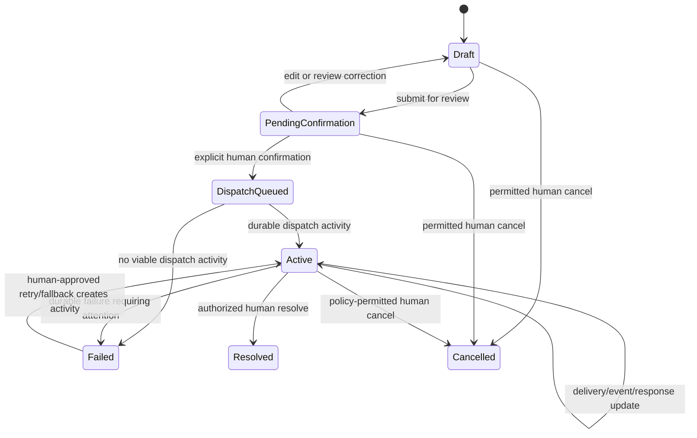

# Alert State Machine

Status: Simulation response/lifecycle implementation over the Phase 0 state and transition contract. It does not define a hospital's clinical responsibility, escalation, cancellation, fallback, or resolution policy.

## Alert lifecycle states

The alert lifecycle state is separate from recipient delivery and response state.

| State | Meaning | Entry control |
|---|---|---|
| `Draft` | Editable typed source, SBAR content, and later recipient-selection work. | Human operator creates or edits. |
| `PendingConfirmation` | A complete draft is awaiting the later human review/confirmation phase. | Server validates required fields and critical values. |
| `DispatchQueued` | Exact version and recipients were explicitly confirmed and a durable dispatch request exists. | Authenticated human confirmation transaction only. |
| `Active` | Dispatch/response workflow is in progress or has durable activity. | Worker records delivery work/activity. |
| `Resolved` | An authorized human recorded the approved resolution outcome. | Production condition is `REQUIRES_HOSPITAL_DECISION`; simulation requires explicit test action. |
| `Cancelled` | An authorized human recorded cancellation where policy permits. | Permission and timing are `REQUIRES_HOSPITAL_DECISION`. |
| `Failed` | Durable failure requires operator attention or approved fallback. | Server/worker records a failure; it must not disappear. |

## Candidate transition diagram

```mermaid
stateDiagram-v2
    [*] --> Draft
    Draft --> PendingConfirmation: submit for review
    PendingConfirmation --> Draft: edit or review correction
    PendingConfirmation --> DispatchQueued: explicit human confirmation
    DispatchQueued --> Active: durable dispatch activity
    DispatchQueued --> Failed: no viable dispatch activity
    Active --> Active: delivery/event/response update
    Active --> Failed: durable failure requiring attention
    Active --> Resolved: authorized human resolve
    Draft --> Cancelled: permitted human cancel
    PendingConfirmation --> Cancelled: permitted human cancel
    Active --> Cancelled: policy-permitted human cancel
    Failed --> Active: human-approved retry/fallback creates activity
```

The diagram shows possible simulation transitions, not permission to infer a production policy. Whether a transition is allowed, who may perform it, and which event is sufficient are `REQUIRES_HOSPITAL_DECISION` unless explicitly stated as a simulation-only fixture.

## Phase 2 implementation mapping

Phase 2 persists the Phase 0 lifecycle states above. Names used in some later summaries map as follows and are not extra production states:

| Later summary name | Phase 2 persistence |
|---|---|
| AwaitingConfirmation | `PendingConfirmation` |
| Approved | Confirmation metadata on a specific draft version; the lifecycle state becomes `DispatchQueued` |
| Dispatching / Dispatched | `DispatchQueued` then `Active` |
| Delivered, Acknowledged, Accepted | Recipient delivery and response records, not alert lifecycle states |

## Phase 5 drafting boundary

Phase 5 exposes only typed simulation draft creation/editing, protected source and SBAR storage, optimistic draft-version checks, critical-field confirmation, and submission to `PendingConfirmation`. Source and SBAR text must carry the `SIMULATION:` marker; patient references remain `SIM-` values. Critical fields are unresolved until an authenticated human confirms the exact value and unit.

The Phase 5 API does not select recipients, confirm dispatch, create outbox work, call providers, or run escalation. Those are later phases and remain unavailable.

## Phase 7 dispatch boundary

Phase 6 confirmation is the only entry into `DispatchQueued`. Phase 7 may move a confirmed alert to `Active` only after a durable simulation delivery attempt is recorded. The worker does not create a recipient, alter the approved version, infer a role, or select a new channel. It records delivery attempts and normalized synthetic provider events separately from opened, acknowledged, and responsibility-accepted states. A completed simulation delivery does not resolve the alert, and an outage or invalid dispatch remains visible as `Failed` or queued retry activity.

## Phase 8 response boundary

Phase 8 response commands are available only in Development/Test to an authenticated Practitioner or Physician with an explicit organization-scoped user-to-practitioner link. The linked practitioner may act only on a confirmed `Active` alert version that explicitly addresses that practitioner. Display name, development handle, request body, route data, and caller-supplied organization values cannot establish practitioner identity or scope.

SecureMessage opening, acknowledgement, call-unit request, terminal disposition, responsibility assignment, and alert lifecycle are independent dimensions. Acknowledgement or a call-unit request does not create responsibility. `Accepted` creates one durable responsibility assignment tied to the exact practitioner, alert, version, and accepted response. `Declined` and `Unavailable` create no assignment; in Phase 8 they triggered no escalation (Phase 9 DEMO escalation consumes a new one as an expedite signal, see Phase 9 escalation evaluation below). Responses do not automatically change the alert lifecycle. An authorized simulation operator may cancel an `Active` alert, or resolve it only when an unreleased responsibility assignment exists for the exact confirmed version; both actions require an idempotency key and exact-version check. Delivery failures remain visible and may show a non-routing manual-fallback placeholder marked `REQUIRES_HOSPITAL_DECISION`.

### Phase 8 response semantics (simulation-only)

- Responses are scoped by organization, alert, confirmed alert version and practitioner, not by channel, because one practitioner may be selected on several channels. SecureMessage open is recorded on that channel's delivery attempt; SMS and Voice stay `NotApplicable`.
- Acknowledgement is one independent, idempotent event. Exactly one terminal disposition (`Accepted`, `Declined` or `Unavailable`) is allowed per practitioner and version; a conflicting disposition, or a reused idempotency key with a different request, returns a safe conflict. Changing, releasing or transferring a disposition is excluded and `REQUIRES_HOSPITAL_DECISION`.
- `CallUnitRequested` is a separate, non-terminal, idempotent event. It carries only an allowlisted simulation reason code (no free text) and never pages or contacts a real unit.
- The first `Accepted` response atomically creates exactly one responsibility assignment for the exact practitioner, alert, version and accepted response; it does not resolve the alert.
- `Resolve` requires an `Active` alert with an unreleased responsibility assignment at the exact confirmed version; `Cancel` requires an `Active` alert. Both need an idempotency key and the exact version.
- A failed delivery shows a manual-fallback placeholder that contains no route or contact value and is marked `REQUIRES_HOSPITAL_DECISION`.

## Dispatch confirmation invariant

The server may enter `DispatchQueued` only when all of the following are true:

- The caller is authenticated and authorized for the organization.
- The request names the exact current draft version.
- Required source/template fields are present according to the approved template.
- Every required critical number and unit is explicitly confirmed by a human for that version.
- The approved message is the exact message shown in the review screen.
- Every recipient and channel is explicitly present in the request and persisted.
- Recipients are manually selected, active, and sufficiently disambiguated.
- The referenced notification and escalation policy versions are durable.
- The operation is idempotent and protected by optimistic concurrency.
- The approval, state transition, audit event, recipients, and `AlertDispatchRequested` outbox record commit atomically.

Editing any source, structured approved field, critical value/unit, urgency, recipient, channel, or policy reference increments the draft version and invalidates the prior approval.

## Delivery and response dimensions

For each recipient and channel, record separate states such as:

`requested`, `submitted/accepted by provider`, `delivered`, `failed`, and provider-event metadata.

For every supported delivery state, distinguish `Pending/NotObserved`, `Occurred`, and `Failed`. If the channel cannot produce that state, record `NotApplicable`. Never infer `Opened`, `Acknowledged`, or responsibility acceptance from delivery alone.

For each recipient, record separately:

`opened`, `acknowledged`, `responsibility accepted`, `declined`, and `unavailable`.

These are not interchangeable:

- `submitted` is not `delivered`.
- `delivered` is not `opened`.
- `opened` is not `acknowledged`.
- `acknowledged` is not responsibility accepted.
- Responsibility accepted does not silently resolve the alert.

## Escalation invariant

Escalation evaluates the approved policy version captured at confirmation using durable UTC/database time. It may create further work only according to that policy. AI output, a browser timer, provider callback text, or an unreviewed directory change cannot change or stop escalation.

The trigger, delay, retry limit, stop condition, backup hierarchy, override, and manual fallback are `REQUIRES_HOSPITAL_DECISION`. Simulation timing must be labelled `DEMO` and driven by a deterministic fake clock.

### Phase 9 escalation evaluation (simulation-only DEMO)

Run processing locks the alert (the shared mutation lock above), then the run, then evaluates in this fixed order: Resolved/Cancelled; active exact-version responsibility assignment; paused; new decline/unavailable signal; deadline; wait. PostgreSQL `clock_timestamp()` supplies the time.

- Acceptance wins if its responsibility assignment is durable when the locked run is processed. Resolve and Cancel also stop escalation. Delivery, opening and acknowledgement never stop it.
- A decline or unavailable response expedites the next step and is consumed once, so one earlier response cannot exhaust every remaining step.
- An empty step is visible and exhausts safely with no replacement lookup. Exhaustion without responsibility shows the manual-fallback placeholder; its real route is `REQUIRES_HOSPITAL_DECISION`.
- Pause stores a nonnegative remaining delay measured on the database clock; Resume restores it, with immediate eligibility when it is already due. There is no permanent stop action.
- Only alerts confirmed with an exact policy snapshot get a run. Legacy alerts without a snapshot stay escalation-disabled and are never backfilled.
- Run events are append-only, identifier-only and written in the same transaction as the state change.
- Delays and recipients in the seeded `DEMO-9` policy are simulation fixtures; all production values remain `REQUIRES_HOSPITAL_DECISION`. See [simulated dispatch](simulated-dispatch.md).

## Illegal transitions and required tests

Simulation opened/response commands and resolve/cancel commands acquire the same organization-scoped PostgreSQL alert row lock inside their transaction before reading idempotency or current state. A command that follows a committed terminal lifecycle transition cannot append a new response or responsibility assignment. A resolution that follows a committed acceptance sees its durable responsibility assignment. Successful idempotent replays remain available without creating new events.

Implementation must reject and test:

- Confirmation with zero recipients.
- Confirmation with missing required fields.
- Confirmation with unresolved critical numbers or units.
- Confirmation of an older draft version.
- Dispatch before durable confirmation.
- Duplicate recipient selection.
- Inactive recipient selection.
- Editing without invalidating approval.
- Response actions without recipient authorization.
- Resolution/cancellation without required authorization.
- Cancellation after resolution.
- Provider event replay that regresses durable status.

Every valid transition writes an audit event without duplicating the full clinical payload.
