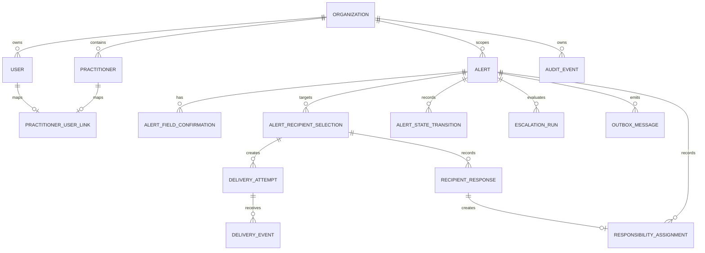

# Conceptual Data Model

Status: Conceptual model through the Phase 8 simulation-response boundary. It is a design boundary for fictional simulation data, not a production schema approval.

## Design rules

- Every organization-owned table carries `organization_id` or has an intentional, documented relationship to one.
- All timestamps are UTC.
- Alert and audit records are not hard-deleted through normal application code.
- Editable drafts use optimistic concurrency.
- Append-only state transitions, delivery events, responses, and audit events preserve chronology.
- Sensitive content is protected behind an `ISensitiveDataProtector` interface; no reversible key is placed in frontend code.
- Outbox payloads contain identifiers and control metadata only, not clinical bodies.
- Simulation rows use synthetic identifiers and are guarded by environment checks.

## Migration order from the master plan

### 001 — organizations and locations

Concepts: `organizations`, `sites`, and `departments`.

Production organization hierarchy, data residency, time zone, and tenancy semantics are `REQUIRES_HOSPITAL_DECISION`. Simulation uses one fictional organization and fictional locations.

### 002 — identity and authorization

Concepts: `users`, `roles`, `user_roles`, and `external_identities`.

Simulation identities are fixed fictional users. Production identity provider, tenant restriction, MFA, role mapping, break-glass process, and deprovisioning are `REQUIRES_HOSPITAL_DECISION`.

Phase 8 adds `practitioner_user_links` as the sole user-to-practitioner authority for response routes. Each link carries `organization_id`, `user_id`, and `practitioner_id`; PostgreSQL enforces one linked practitioner per organization/user and one linked user per organization/practitioner. The server resolves the link from the authenticated principal and never infers it from a display name or development handle.

### 003 — practitioner directory

Concepts: `practitioners`, `practitioner_roles`, `contact_endpoints`, `on_call_assignments`, `directory_source_records`, and `directory_sync_runs`.

Never match a practitioner solely by name. Store stable source identifiers separately from the internal practitioner. Endpoint values are protected or represented by provider references. Production source, freshness threshold, deactivation, on-call meaning, and conflict resolution are `REQUIRES_HOSPITAL_DECISION`.

### 004 — templates and policies

Concepts: `alert_templates`, `notification_policies`, `escalation_policies`, and `escalation_steps`.

Templates, approved terminology, required fields, numeric confirmation fields, channel wording, retry limits, trigger conditions, stop conditions, delay, backup hierarchy, and override authority are `REQUIRES_HOSPITAL_DECISION`. Simulation policies are versioned and labelled `DEMO`.

### 005 — alerts and provenance

Concepts: `alerts`, `alert_field_confirmations`, `alert_recipient_selections`, and `alert_state_transitions`.

An alert stores or references the following separate representations:

| Representation | Purpose | Authority |
|---|---|---|
| Original typed source | Exact operator input. | Human-created source; immutable history. |
| Exact transcription | Exact provider transcript when dictation is enabled. | Provider output; not approved content. |
| Structured suggestion | Fielded/SBAR-style proposal, evidence spans, confidence, missing fields, and ambiguities. | Non-authoritative suggestion. |
| Approved message/version | Exact human-reviewed content for a specific draft version. | Dispatchable only after explicit confirmation. |
| Critical-field confirmation | Per-field approved value, unit, actor, time, and draft version. | Human confirmation required. |
| Recipient selection | Practitioner, selected channel, selection source, actor, and directory timestamp shown. | Manual human selection. |

The alert may carry a synthetic patient reference, location, operator-selected urgency, source type, protected source/approved content, structured payload reference, current draft version, workflow state, confirmation metadata, resolution metadata, and concurrency token. Full patient charts, real identifiers, and unapproved clinical payloads are out of scope.

The `SIM-` patient-reference prefix is a `SimulationEnvironmentPolicy` for Development/Test. It is not a `HealthcareDomainInvariant`. Production patient-reference formats are `REQUIRES_HOSPITAL_DECISION`.

### `user_roles` uniqueness

A user may hold a role at most once in an organization. Persistence enforces `UNIQUE (organization_id, user_id, role_id)` as both the composite primary key and the named unique index `UX_user_roles_organization_id_user_id_role_id`. Duplicate assignments such as Operator/Operator/Operator for the same user are rejected by PostgreSQL.

### Canonical critical-field confirmation

`alert_field_confirmations` stores the **current effective confirmation** for a field on an exact alert draft version, not an attempt history.

PostgreSQL enforces:

`UNIQUE (alert_id, alert_version, field_id)`

named `UX_alert_field_confirmations_alert_id_alert_version_field_id`. Re-confirming or replacing an unresolved value for the same field and version updates that canonical row. Confirmation history, if required later, must be a separate table; it must not be inferred from this one.

### Source and draft version rule

Every source edit creates a new draft version. The typed source and exact transcription associated with each version remain immutable history; structured suggestions may be regenerated against a version; approved content references one exact version and cannot be silently replaced. A confirmation for an older version is rejected.

### 006 — deliveries and responses

Concepts: `delivery_attempts`, `delivery_events`, `recipient_responses`, `responsibility_assignments`, and future `escalation_runs`.

Delivery, provider submission, delivery, opening, acknowledgement, responsibility acceptance, decline, unavailable, and escalation are separate records or state dimensions. Each channel declares whether a state is supported; unsupported states are recorded as `NotApplicable`, while supported but unseen states remain pending/not observed. Provider event IDs are unique and callbacks are idempotent.

Phase 8 stores `opened_at_utc` on a SecureMessage delivery attempt. SMS and Voice opening remain `NotApplicable`; provider delivery never implies opening.

Practitioner responses are keyed to the organization, alert, exact alert version, and practitioner. PostgreSQL permits at most one acknowledgement category and at most one terminal disposition category per practitioner/alert/version, even when the alert has multiple channels. A response stores an allowlisted reason code rather than free text. An accepted response may own exactly one `responsibility_assignment`, also scoped to the organization and exact alert version; acknowledgement, decline, and unavailable create none. Responses and assignments do not alter the alert lifecycle in Phase 8.

The exact relationship between a response and a hospital responsibility transfer is `REQUIRES_HOSPITAL_DECISION`; the simulation keeps acknowledgement, disposition, assignment, and lifecycle separate so no production clinical responsibility rule is inferred.

### 007 — reliable work and audit

Concepts: `outbox_messages`, `inbox_messages`, `idempotency_records`, and `audit_events`.

Outbox payloads contain identifiers only. Inbox uniqueness is `(external_message_id, handler)`. Idempotency keys are scoped by organization, operation, and request hash. Audit events are append-only, actor/resource/action oriented, and sanitized.

## Relationships

## Protection and retention

Formal classification, retention, deletion, legal hold, export, access review, encryption algorithms, key custody, and residency are `REQUIRES_HOSPITAL_DECISION`. Until approved, keep the simulation synthetic, minimize payloads, exclude clinical bodies from logs, and do not enable retention jobs.

## Database safety requirements for implementation

- Intentional foreign-key delete behavior for every relationship.
- Explicit indexes for active directory search, alert timelines, due escalation, and outbox leasing.
- Constraints for status values with a documented migration strategy.
- Separate migration and runtime database roles in production.
- Real PostgreSQL integration tests with Testcontainers.
- No in-memory substitute for relational behavior.
