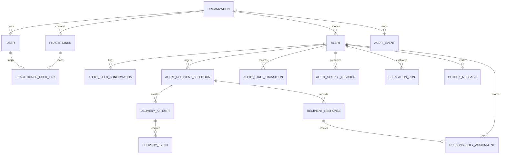

# Conceptual Data Model

Status: Conceptual model including simulation-only escalation and assistance results. It is a design boundary for fictional simulation data, not a production schema approval.

Phase 9 adds `confirmed_escalation_plans` (immutable organization/alert/version/policy identity and exact reviewed future-recipient JSON) and `escalation_events` (append-only enum, sequence, step, UTC and identifiers). `escalation_runs` adds nullable exact alert version for legacy compatibility, unique organization/alert/version, an approval foreign key, leases, next-check time, remaining pause delay, consumed negative-response count and stop reason. Historical approvals are never inferred. Activation uses the existing selection table with `EscalationPolicy` provenance and the confirmed version. Three additive Phase 9 migrations preserve historical migrations.

## Design rules

- Every organization-owned table carries `organization_id` or has an intentional, documented relationship to one.
- All timestamps are UTC.
- Alert and audit records are not hard-deleted through normal application code.
- Editable drafts use optimistic concurrency.
- Append-only state transitions, delivery events, responses, and audit events preserve chronology.
- Sensitive content is protected behind an `ISensitiveDataProtector` interface; no reversible key is placed in frontend code.
- Outbox payloads contain identifiers and control metadata only, not clinical bodies.
- Simulation rows use synthetic identifiers and are guarded by environment checks.

## Migration order from the master plan

### 001 — organizations and locations

Concepts: `organizations`, `sites`, and `departments`.

Production organization hierarchy, data residency, time zone, and tenancy semantics are `REQUIRES_HOSPITAL_DECISION`. Simulation uses one fictional organization and fictional locations.

### 002 — identity and authorization

Concepts: `users`, `roles`, `user_roles`, and `external_identities`.

Simulation identities are fixed fictional users. Production identity provider, tenant restriction, MFA, role mapping, break-glass process, and deprovisioning are `REQUIRES_HOSPITAL_DECISION`.

Phase 8 adds `practitioner_user_links` as the sole user-to-practitioner authority for response routes. Each link carries `organization_id`, `user_id`, and `practitioner_id`; PostgreSQL enforces one linked practitioner per organization/user and one linked user per organization/practitioner. The server resolves the link from the authenticated principal and never infers it from a display name or development handle.

### 003 — practitioner directory

Concepts: `practitioners`, `practitioner_roles`, `contact_endpoints`, `on_call_assignments`, `directory_source_records`, and `directory_sync_runs`.

Never match a practitioner solely by name. Store stable source identifiers separately from the internal practitioner. Endpoint values are protected or represented by provider references. Production source, freshness threshold, deactivation, on-call meaning, and conflict resolution are `REQUIRES_HOSPITAL_DECISION`.

### 004 — templates and policies

Concepts: `alert_templates`, `notification_policies`, `escalation_policies`, and `escalation_steps`.

Templates, approved terminology, required fields, numeric confirmation fields, channel wording, retry limits, trigger conditions, stop conditions, delay, backup hierarchy, and override authority are `REQUIRES_HOSPITAL_DECISION`. Simulation policies are versioned and labelled `DEMO`.

### 005 — alerts and provenance

Concepts: `alerts`, `alert_field_confirmations`, `alert_recipient_selections`, `alert_source_revisions`, and `alert_state_transitions`.

An alert stores or references the following separate representations:

| Representation | Purpose | Authority |
|---|---|---|
| Original typed source | Exact operator input. | Human-created source; immutable history. |
| Exact transcription | Exact provider transcript when dictation is enabled. | Provider output; not approved content. |
| Structured suggestion | Fielded/SBAR-style proposal, evidence spans, confidence, missing fields, and ambiguities. | Non-authoritative suggestion. |
| Approved message/version | Exact human-reviewed content for a specific draft version. | Dispatchable only after explicit confirmation. |
| Critical-field confirmation | Per-field approved value, unit, actor, time, and draft version. | Human confirmation required. |
| Recipient selection | Practitioner, selected channel, selection source, actor, and directory timestamp shown. | Manual human selection. |

The alert may carry a synthetic patient reference, location, operator-selected urgency, source type, protected source/approved content, structured payload reference, current draft version, workflow state, confirmation metadata, resolution metadata, and concurrency token. The patient reference is persisted as purpose-bound ciphertext (`simulation_patient_reference_ciphertext`, key version, and purpose), never as a plaintext database column. Full patient charts, real identifiers, and unapproved clinical payloads are out of scope.

The `SIM-` patient-reference prefix is a `SimulationEnvironmentPolicy` for Development/Test. It is not a `HealthcareDomainInvariant`. Production patient-reference formats are `REQUIRES_HOSPITAL_DECISION`.

### `user_roles` uniqueness

A user may hold a role at most once in an organization. Persistence enforces `UNIQUE (organization_id, user_id, role_id)` as both the composite primary key and the named unique index `UX_user_roles_organization_id_user_id_role_id`. Duplicate assignments such as Operator/Operator/Operator for the same user are rejected by PostgreSQL.

### Source revision history

`alert_source_revisions` is append-only application history keyed by organization, alert, and draft version. Each row stores the protected source body, source type, creator, and UTC creation time. The first operator source and every later correction remain reconstructable; `OriginalSource` is not overwritten by an edit. A migration encrypts the retired plaintext patient-reference column with the configured data-protection key before dropping that column.

### Canonical critical-field confirmation

`alert_field_confirmations` stores the **current effective confirmation** for a field on an exact alert draft version, not an attempt history.

PostgreSQL enforces:

`UNIQUE (alert_id, alert_version, field_id)`

named `UX_alert_field_confirmations_alert_id_alert_version_field_id`. Re-confirming or replacing an unresolved value for the same field and version updates that canonical row. Confirmation history, if required later, must be a separate table; it must not be inferred from this one.

### Source and draft version rule

Every source edit creates a new draft version. The typed source and exact transcription associated with each version remain immutable history; structured suggestions may be regenerated against a version; approved content references one exact version and cannot be silently replaced. A confirmation for an older version is rejected.

### 006 — deliveries and responses

Concepts: `delivery_attempts`, `delivery_events`, `recipient_responses`, `responsibility_assignments`, and future `escalation_runs`.

Delivery, provider submission, delivery, opening, acknowledgement, responsibility acceptance, decline, unavailable, and escalation are separate records or state dimensions. Each channel declares whether a state is supported; unsupported states are recorded as `NotApplicable`, while supported but unseen states remain pending/not observed. Provider event IDs are unique and callbacks are idempotent.

Phase 8 stores `opened_at_utc` on a SecureMessage delivery attempt. SMS and Voice opening remain `NotApplicable`; provider delivery never implies opening. Recipient responses include an allowlisted reason code; a non-terminal `CallUnitRequested` event is distinct from acknowledgement and terminal disposition.

Practitioner responses are keyed to the organization, alert, exact alert version, and practitioner. PostgreSQL permits at most one acknowledgement category, one call-unit request category, and one terminal disposition category per practitioner/alert/version, even when the alert has multiple channels. A response stores an allowlisted reason code rather than free text. An accepted response may own exactly one `responsibility_assignment`, also scoped to the organization and exact alert version; acknowledgement, call-unit request, decline, and unavailable create none. Responses do not automatically alter the alert lifecycle; separately authorized operator resolve/cancel commands do, subject to exact-version and responsibility preconditions.

The exact relationship between a response and a hospital responsibility transfer is `REQUIRES_HOSPITAL_DECISION`; the simulation keeps acknowledgement, disposition, assignment, and lifecycle separate so no production clinical responsibility rule is inferred.

### 007 — reliable work and audit

Concepts: `outbox_messages`, `inbox_messages`, `idempotency_records`, and `audit_events`.

Outbox payloads contain identifiers only. Inbox uniqueness is `(external_message_id, handler)`. Idempotency keys are scoped by organization, operation, and request hash. Audit events are append-only, actor/resource/action oriented, and sanitized.

## Relationships

```mermaid
erDiagram
    ORGANIZATION ||--o{ USER : owns
    ORGANIZATION ||--o{ PRACTITIONER : contains
    USER ||--o| PRACTITIONER_USER_LINK : maps
    PRACTITIONER ||--o| PRACTITIONER_USER_LINK : maps
    ORGANIZATION ||--o{ ALERT : scopes
    ALERT ||--o{ ALERT_FIELD_CONFIRMATION : has
    ALERT ||--o{ ALERT_RECIPIENT_SELECTION : targets
    ALERT ||--o{ ALERT_STATE_TRANSITION : records
    ALERT ||--o{ ALERT_SOURCE_REVISION : preserves
    ALERT_RECIPIENT_SELECTION ||--o{ DELIVERY_ATTEMPT : creates
    DELIVERY_ATTEMPT ||--o{ DELIVERY_EVENT : receives
    ALERT_RECIPIENT_SELECTION ||--o{ RECIPIENT_RESPONSE : records
    RECIPIENT_RESPONSE ||--o| RESPONSIBILITY_ASSIGNMENT : creates
    ALERT ||--o{ RESPONSIBILITY_ASSIGNMENT : records
    ALERT ||--o{ ESCALATION_RUN : evaluates
    ALERT ||--o{ OUTBOX_MESSAGE : emits
    ORGANIZATION ||--o{ AUDIT_EVENT : owns
```

## Protection and retention

Formal classification, retention, deletion, legal hold, export, access review, encryption algorithms, key custody, and residency are `REQUIRES_HOSPITAL_DECISION`. Until approved, keep the simulation synthetic, minimize payloads, exclude clinical bodies from logs, and do not enable retention jobs.

## Database safety requirements for implementation

- Intentional foreign-key delete behavior for every relationship.
- Explicit indexes for active directory search, alert timelines, due escalation, and outbox leasing.
- Constraints for status values with a documented migration strategy.
- Separate migration and runtime database roles in production.
- Real PostgreSQL integration tests with Testcontainers.
- No in-memory substitute for relational behavior.

## Speech and AI suggestion results

All features default disabled; production decisions remain `REQUIRES_HOSPITAL_DECISION`.

Phase 11 adds `alert_assistance_results` (closed Transcription/Structuring kinds): organization, alert, source revision, exact alert version, actor, UTC timestamp, bounded provider/configuration versions and encrypted payload with distinct transcription/structuring purposes. Source provenance uses a composite FK on source ID/organization/alert/version. New source alternate key and bounded history index are additive. UPDATE/DELETE/TRUNCATE are denied by a statement trigger; EF rejects result mutation. Payload encryption uses `local-v2-context` with authenticated purpose+organization; existing Phase 10 purposes retain `local-v1`. Audio has no storage representation. Provider results, human source revisions, editable SBAR and approved message remain separate. Number/unit confirmations reuse the existing model; full transcript content is never copied to plaintext confirmation fields. Migration: `20260919193851_Phase11AssistanceResults`.

## Real communication adapters (ACS SMS, provider-neutral voice)

Phase 12 adds two things:

- **Provider-reference index:** `IX_delivery_attempts_provider_reference` is a filtered index on `delivery_attempts (provider, provider_reference)`. Authenticated delivery reports use it to find their attempt. Migration: `20260930000833_Phase12ProviderReferenceLookup`.
- **`provider_send_ledger`:** one row per provider attempt that needs a replay-stable first-send time. Columns: `organization_id`, `provider`, `attempt_idempotency_key` (unique together as `UX_provider_send_ledger_attempt`) and `first_sent_at_utc`. Migration: `20261007022418_Phase12ProviderSendLedger`.

The worker writes the ledger row on its own connection immediately before the network call, insert-if-absent then read. The row therefore survives a rollback of the dispatch transaction. Its only foreign key is to `organizations` (restrict), which is never locked for update, so the separate write cannot wait on the worker's alert lock.

The ledger holds no recipient, number, message or clinical data, and rows are never updated. Retention is `REQUIRES_HOSPITAL_DECISION`, like delivery attempts. Before creating any attempt, the worker also reads the ledger for that attempt key under every provider, so a rolled-back ACS send cannot be recreated under another provider.

Phase 12 slice 2 (provider-neutral voice) adds, in migration `20261008193530_Phase12VoiceCallEvents`:

- **Ledger binding:** `provider_send_ledger.callback_tag` and `provider_send_ledger.operation_fingerprint` (both nullable; SMS rows leave them empty). The tag is an opaque hash of the attempt key; the fingerprint is a SHA-256 of the provider name, provider account identity, caller ID, mapped test number, spoken text and repeat count, so no number or text is stored. `UX_provider_send_ledger_callback_tag` is unique on `(provider, callback_tag)` where the tag is set.
- **`pending_provider_call_events`:** authenticated call events whose call ID is not committed yet but whose tag matches a committed send. Columns: organization, provider, callback tag, external event ID (unique per provider as `UX_pending_provider_call_events_event`), call ID, closed kind and end reason, occurred and received times, and the time and result (`applied` or `rejected-call-mismatch`) of the worker pass that consumed it. Its only foreign key is to `organizations`, so the callback intake never waits on the worker's alert lock. Retention is `REQUIRES_HOSPITAL_DECISION`.

`outbox_messages.worker_failure_count` (default 0) counts only unexpected worker failures and is the bounded failure budget compared with `MaxAttempts`. `attempt_count` still counts every lease claim, including routine re-polls while a delivery report is awaited. Migration: `20261007032738_Phase12WorkerFailureBudget`.
