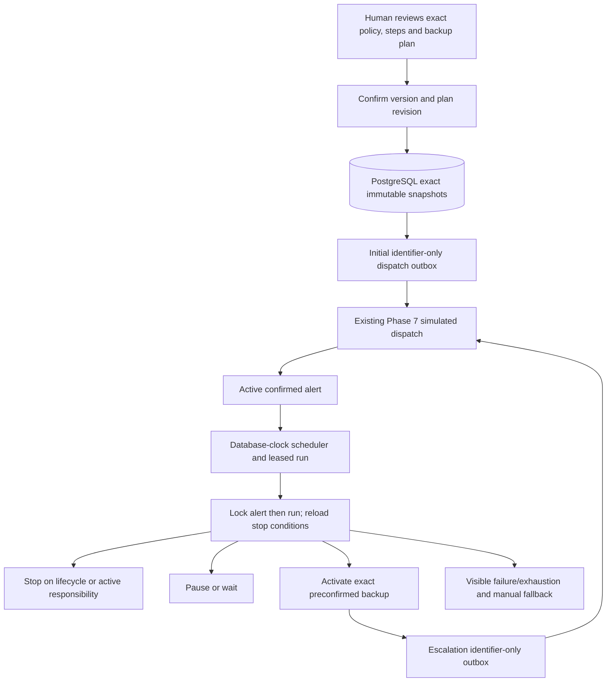

# Escalation architecture

Status: Phase 9 implementation specification, authorized 2026-09-07. Runtime implementation and verification are tracked separately in the [plan](../superpowers/plans/2026-09-07-phase-9-escalation.md). The full contract is the [Phase 9 design](../superpowers/specs/2026-09-07-phase-9-escalation-design.md). This is a fictional Development/Test simulation; every production policy is `REQUIRES_HOSPITAL_DECISION`.

## Authority and flow

No worker resolves an arbitrary backup at a deadline. Review shows policy ID/version, plan revision, ordered DEMO delays and exact future recipients/channels with directory/on-call evidence. Confirmation revalidates consistently and returns 409 `escalation-plan-changed` on changes, without side effects. Immutable policy rules and steps are copied into the exact organization/alert/version confirmation snapshot. Historical placeholder-only confirmations remain explicitly ineligible; no guessed backfill.

## Transactions and clocks

PostgreSQL UTC time determines schedule, due, lease expiry, pause and resume. Pure domain tests may supply explicit UTC instants. Browser countdowns and read-only polling have no execution authority. Scheduler creates one run per organization/alert/confirmed version only after Active state. Stored deadlines survive worker/browser restarts.

Every response/acceptance, lifecycle, scheduling, activation and override transaction takes the organization-scoped alert row lock before its run lock and dependent rows. Candidate discovery does not hold the run lock first. Reload stop conditions after claim: terminal lifecycle, exact-version active responsibility, pause, unconsumed decline/unavailable, due time, wait. A committed acceptance visible under the shared lock wins over timeout; activation that commits first is a distinct valid serialization. Only the unexpired current lease owner may complete processing; expired leases are reclaimable.

One atomic activation transaction persists exact-version selections, consumed trigger, step state, append-only timeline, audit and identifier-only outbox. Unique constraints prevent duplicate run, step/recipient activation, trigger consumption and logical outbox. Decline/unavailable consumption references an exact durable response ID once per run and commits with the triggered step; it cannot repeatedly expedite later steps after polling/restart. Signals wait while paused. Resume restores stored remaining delay, including zero, and then considers pending signals.

## Recipient and dispatch safety

Future snapshots grant no recipient inbox access until activation. Activation creates `SelectionSource = EscalationPolicy` rows for the exact confirmed version without changing approved content or DraftVersion. Current eligibility checks can fail closed but cannot replace a clinician or rewrite the plan. Inactive/missing/foreign/channel-ineligible confirmed backups produce durable visible ProcessingFailed/manual fallback and zero activation/outbox for that step. No automatic substitute or silent partial activation is allowed.

`EscalationDispatchRequested` carries only `alertId`, `alertVersion`, `escalationRunId`, `stepSequence` and `recipientSelectionIds`. The Phase 7 processor validates those IDs against organization-scoped durable run/step/snapshots and processes only newly activated recipients, preserving existing retry/lease/idempotent attempt behavior. Escalation never invokes notification channels directly. Provider failures remain visible.

## DEMO status and human controls

Delivered, opened, acknowledged and call-unit requested do not stop escalation. Active exact-version responsibility, Cancel and Resolve stop it. Decline/unavailable expedite the next eligible step once. Pause suppresses automation; Resume restores remaining delay. Exhaustion is a completed automatic plan with a visible unresolved manual-fallback warning, not resolved clinical responsibility.

Pause/Resume alone are added as organization-scoped, exact-version, authenticated lifecycle-role commands with required idempotency keys, allowlisted reasons and atomic audit/timeline. No permanent stop button is added. Live exposes eligibility, policy/version, state, step, next due UTC, stop/pause/exhaustion/failure and timeline, plus explicit backup provenance. Five-second polling retains last durable state on failure and cleans up on unmount. All timing is labelled DEMO.

## Data boundary and gate

Use an additive EF migration for exact plan/recipient snapshots, run lease/pause/version fields, consumed response references and append-only events. Do not modify historical migrations. Timeline and audit contain identifiers, safe event/reason codes and UTC times only; no message, patient reference, contact endpoint, phone, ciphertext, provider payload or arbitrary text. Live retains the existing protected-value exclusions.

Development/Test guards fail startup when escalation is enabled elsewhere. No AI, real providers, callbacks, hospital integrations, real data, production escalation period or Phase 10 is included. Hospital trigger/timing/stop/override/fallback, directory/identity authority and all clinical/privacy/security/hosting decisions remain `REQUIRES_HOSPITAL_DECISION`. Verification must prove exact confirmation, legacy isolation, database time, shared-lock races, exactly-once signal/activation/outbox, inactive backup failure, restart, two workers, negative API/privacy cases and real connected E2E before human review.
