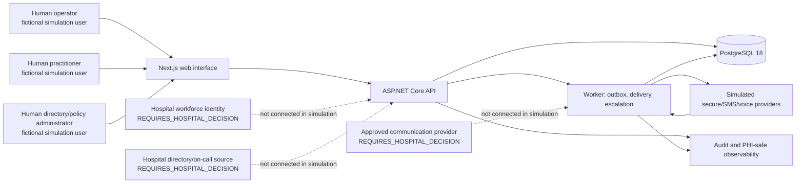

# System Context

Status: Phase 0 architecture baseline for a fictional simulation. No external hospital connection is authorized by this document.

## Purpose

The platform helps an authorized human operator prepare, confirm, dispatch, and monitor an urgent clinician notification. It records a closed-loop communication timeline without creating the appearance that a machine accepted clinical responsibility.

## Context diagram

## Actors

| Actor | Allowed simulation interaction | Production status |
|---|---|---|
| Operator | Enters source, reviews content, confirms critical values, selects recipients, confirms dispatch, monitors status, and performs explicitly permitted actions. | Role, scope, and authorization are `REQUIRES_HOSPITAL_DECISION`. |
| Practitioner/Physician | Opens a fictional alert and records acknowledgement, call-unit request, responsibility acceptance, decline, or unavailability. | Identity, clinical role, and response authority are `REQUIRES_HOSPITAL_DECISION`. |
| Clinical supervisor | Views safe live simulation status and may perform fixture-approved lifecycle actions. | Scope, clinical authority, and separation of duties are `REQUIRES_HOSPITAL_DECISION`. |
| Directory administrator | Imports fictional CSV data and reviews freshness/conflicts. | Source, ownership, and administrative authority are `REQUIRES_HOSPITAL_DECISION`. |
| Integration administrator | Controls only fictional dispatch scenarios in Development/Test. | Provider ownership, credentials, and integration authority are `REQUIRES_HOSPITAL_DECISION`. |
| Auditor/system administrator | Reads sanitized audit data or exercises explicit simulation administration policy checks. | Access scope and separation of duties are `REQUIRES_HOSPITAL_DECISION`. |
| Worker | Processes durable outbox work, simulated delivery events, retries, and versioned policy evaluation. | It may not make clinical decisions or stop escalation autonomously. |
| AI/transcription provider | Future suggestion-only boundary. | Provider, data residency, retention, evaluation, and approval are `REQUIRES_HOSPITAL_DECISION`. |

## System boundaries

### Simulation boundary

Development/Test uses fixed fictional identities, fictional data, a fictional CSV, deterministic simulated providers, and a visible `SIMULATION MODE` banner. No real hospital network, workforce identity, directory, scheduling source, SMS/voice provider, or patient system is connected.

### Authenticated application boundary

The web interface and API are the trusted application surface for authenticated users. The server, not the browser, enforces organization scope, role authorization, draft version checks, critical-field confirmation, recipient confirmation, dispatch authorization, lifecycle preconditions, and rate/request limits.

The simulation API allows 120 requests per minute per authenticated organization/user pair. Anonymous callers have separate budgets keyed by the actual connection IP; untrusted forwarded headers cannot select a budget. Authentication runs before this partitioning. Production distributed rate limits and trusted-proxy configuration remain `REQUIRES_HOSPITAL_DECISION`.

### Persistence boundary

PostgreSQL is the durable source for alert versions, recipients, immutable source revisions, confirmation records, delivery events, responses, lifecycle transitions, escalation runs, outbox messages, idempotency records, and audit events. Patient references and other sensitive simulation payloads are encrypted at rest, kept out of ordinary logs, and protected behind a dedicated interface.

### External-provider boundary

Provider callbacks, directory files, scheduling data, identity claims, and future AI results are untrusted inputs. They must be validated, authenticated where applicable, scoped, deduplicated, and prevented from mutating approved content or bypassing human confirmation.

## Primary data flow

1. A human operator creates a fictional draft.
2. The operator reviews original source and structured suggestions separately.
3. The operator explicitly confirms critical numbers and units.
4. The operator manually selects recipients.
5. The API validates the exact version and persists approval, recipients, state transition, audit event, and outbox message atomically.
6. The worker creates channel delivery attempts using stable idempotency keys.
7. Simulated providers emit normalized delivery events.
8. A fictional practitioner responds through the authenticated interface.
9. The worker evaluates only the approved, versioned policy and records escalation work; it never invents a policy or stops escalation based on AI output.
10. A human performs resolution, cancellation, transfer, or fallback actions subject to the approved policy.

## Explicit exclusions

- No autonomous diagnosis, treatment advice, urgency assignment, recipient selection, or dispatch.
- No unrestricted hospital database access.
- No full patient chart or real patient data.
- No production authentication, directory, scheduling, communications, or speech provider in simulation.
- No real voicemail recording or detailed clinical content in SMS/voicemail by default.

