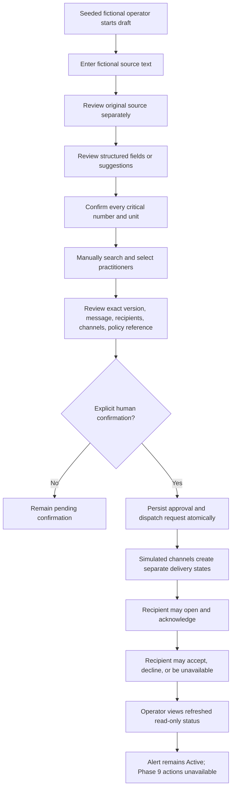

# Workflow Specification

Status: Proposed simulation workflow through the local Phase 8 practitioner-response and operator-status boundary. It is not a hospital-approved clinical workflow, responsibility-transfer rule, or escalation policy.

Phase 6 creates an identifier-only `AlertDispatchRequested` outbox item in the same transaction as the state, audit, and idempotency records. Phase 7 processes that item only through a Development/Test simulation worker and deterministic local adapters. Phase 8 lets the explicitly linked fictional practitioner record opening, acknowledgement, and one terminal disposition for an addressed alert, and lets an Operator or Administrator view a read-only refreshed status projection. It does not call real providers, receive external callbacks, perform escalation, resolve alerts, or transfer clinical responsibility. Production choices remain `REQUIRES_HOSPITAL_DECISION`.

## Workflow identity

- Identifier: `SIM-URGENT-CONSULT-001`.
- Name: fictional urgent specialist consultation.
- Mode: simulation only.
- Human operator: seeded fictional `Operator` user.
- Final recipient: selected manually by the human operator.
- AI role: none required for Phase 0; future transcription and formatting suggestions remain separate from source and approved content.

The production workflow owner, authorized roles, clinical trigger, required data, urgency vocabulary, escalation policy, fallback, and resolution criteria are `REQUIRES_HOSPITAL_DECISION`.

## Safety invariants

1. A human operator creates or edits the source content.
2. Original typed or transcribed content is immutable history and is never replaced by a structured suggestion.
3. Structured fields and AI suggestions are separate from the original source and from approved content.
4. Every critical number and unit is individually confirmed by a human before dispatch.
5. Recipients are manually selected. A specialty suggestion may never select or pre-check a practitioner.
6. The review screen shows the exact alert version, message, critical values and units, recipient list, channel list, and escalation-policy version.
7. Dispatch requires an explicit authenticated human confirmation of that exact version and recipient set.
8. Any edit to content, critical values, units, urgency, policy version, or recipients invalidates confirmation.
9. A provider's accepted/submitted status is not delivery; delivery is not opening; opening is not acknowledgement; acknowledgement is not responsibility acceptance.
10. Only an approved human workflow may stop escalation. AI and background workers may not decide to stop escalation.
11. Failed delivery and provider outage remain visible and actionable.
12. No SMS or voicemail contains patient, clinical, or detailed case content by default.
13. A channel state that is not supported is recorded as `NotApplicable`, not as pending, failed, or successful.

## Simulation flow

## Step-by-step behavior

### 1. Start a draft

The fictional operator starts a draft. The system records the creator and organization scope. The system does not infer urgency or choose a recipient.

The production authorization rule is `REQUIRES_HOSPITAL_DECISION`; the simulation uses only a fixed Development/Test identity.

### 2. Enter source content

The operator types a fictional note. A future transcription adapter may provide an exact transcript, but the transcript is stored as a separate source representation. Every source revision is preserved as immutable history; editing creates a new draft version rather than overwriting the prior source. Raw audio is not retained by default.

The source remains available for review and audit references without putting the clinical payload into ordinary logs.

### 3. Review structured content

Structured SBAR-style fields, missing-field notices, uncertainty markers, and any future AI output are suggestions. They cannot mutate the original source or approved alert directly. The operator must approve the content that will be dispatched.

Ambiguous abbreviations, numbers, units, laterality, dates, times, negation, and medication-like terms remain unresolved until a human confirms them. Missing data remains missing.

### 4. Confirm critical values

Each extracted number is displayed with its unit, source/evidence reference when available, and confirmation state. A draft cannot be dispatched while any required number or unit is unresolved. The exact required set for a real hospital template is `REQUIRES_HOSPITAL_DECISION`.

### 5. Select recipients manually

The operator searches the fictional directory by name, specialty, department, site, and on-call display. Similar names show disambiguating fields. Inactive or stale entries are visibly flagged and selection behavior for a real hospital is `REQUIRES_HOSPITAL_DECISION`.

No background process may add a recipient. The system records who selected each recipient and which directory timestamp was shown.

### 6. Review and confirm

The review screen must display:

- Exact alert draft version.
- Operator-selected urgency, without AI classification.
- Fictional patient reference and location.
- Exact approved message.
- Every critical number and unit with confirmation state.
- Every recipient, role/specialty/site disambiguator, and selected channel.
- Directory freshness timestamp/source.
- Escalation policy/version reference, clearly labelled `DEMO` in simulation.

The operator explicitly confirms the exact version and recipient set. The confirmation operation is idempotent. A second submission of the same idempotency key produces no duplicate dispatch request.

### 7. Queue dispatch

The confirmation transaction persists the approved version, recipients, state transition, audit event, and `AlertDispatchRequested` outbox message together. No provider is called before the approved version is durable.

### Phase 7 simulation dispatch boundary

When `SimulationDispatch:Enabled` is explicitly enabled, the worker may run only in `Development` or `Test`; startup fails closed in `Staging` and `Production`. It claims one pending or expired-lease outbox item with PostgreSQL row locking, records a bounded lease owner and expiry, and reloads the alert, recipients, policy, practitioners, roles, and active synthetic endpoints using the authenticated organization stored on the outbox record. The identifier-only payload is parsed strictly and cannot supply message text, endpoint values, roles, or organization scope.

Each recipient/channel pair gets a stable synthetic attempt key. Typed SecureMessage, SMS, and Voice adapters return deterministic local events for `ImmediateSuccess`, `DelayedDelivery`, `SmsFailure`, `VoiceNoAnswer`, `ProviderOutage`, `DuplicateCallback`, and `OutOfOrderCallback`. The normalizer allowlists event types and safe metadata. Delivery events are unique by `(organization, provider event ID)`, and attempt status only moves forward by status rank and event time; duplicates and late regressions are retained safely without regressing durable state.

The worker marks an outbox item complete only after durable attempts, events, state, and sanitized audit metadata are written. Provider outage/pending work is rescheduled with bounded delay and attempts; validation failures become visible terminal failures. A restart or expired lease can reclaim work without creating a second attempt for the same recipient/channel/attempt number. The delivery-status API returns organization-scoped operational fields only; it does not return protected message or contact endpoint values. No scenario control or status route is a production control surface.

### 8. Deliver and track

The simulation worker creates per-recipient, per-channel delivery attempts with stable idempotency keys. It records these dimensions independently:

- Provider request/submission.
- Delivery outcome.
- Opened outcome when the channel supports an authenticated view; otherwise `NotApplicable`.
- Recipient acknowledgement.
- Responsibility acceptance.

These are not a single linear clinical state. A supported state may be pending/not observed, occurred, failed, or not applicable according to the channel capability. A recipient can acknowledge without accepting responsibility. A provider failure cannot be hidden by a later success on another channel.

### 9. Respond and observe

In Development/Test, the server resolves the authenticated fictional user's practitioner through an explicit organization-scoped link. A mapped Practitioner sees only confirmed Active alerts whose exact version addresses that practitioner. SecureMessage may record an opened timestamp; SMS and Voice report opening as `NotApplicable`.

The practitioner may acknowledge independently and may record exactly one terminal disposition: accepted, declined, or unavailable. Acceptance creates one durable responsibility assignment tied to that exact alert version and response; acknowledgement alone does not. Declined and unavailable remain visible but trigger no automatic next step. Safe reason codes are allowlisted and no free-text reason is accepted.

An Operator or Administrator may view the organization-scoped live projection. The page refreshes on a five-second polling interval and labels the displayed refresh time; it is not a real-time callback or push surface. It exposes operational status only, never protected message content, contact values, or raw provider references.

### 10. Preserve the Phase 8 boundary

Every Phase 8 response leaves the alert lifecycle `Active`. There is no automated or manual escalation, resolution, cancellation, transfer/release, call-unit action, or fallback mutation in this phase. The exact production meaning of acknowledgement, responsibility acceptance, responsibility transfer, escalation, resolution, and fallback remains `REQUIRES_HOSPITAL_DECISION`.

## Exception paths

| Scenario | Required behavior |
|---|---|
| Missing required field | Block confirmation; show the missing field; do not invent a value. Required production fields are `REQUIRES_HOSPITAL_DECISION`. |
| Ambiguous number or missing unit | Block confirmation until the human resolves and confirms the exact number and unit. |
| Operator edits after review | Increment the draft version and invalidate approval; require a fresh review and confirmation. |
| Recipient changes after review | Invalidate approval and require a fresh review and confirmation. |
| Similar practitioner names | Display disambiguating attributes; never select by name alone. |
| Stale/inactive directory entry | Show freshness; block or permit selection only according to `REQUIRES_HOSPITAL_DECISION`; simulation may block it. |
| Duplicate confirmation | Idempotency and optimistic concurrency prevent duplicate dispatch. |
| Provider callback replay/out of order | Authenticate, validate, deduplicate, and normalize without regressing durable state. |
| All channels fail | Show a durable operator-visible failure and the hospital-approved fallback placeholder; never silently disappear. |
| Acknowledged but not accepted | Keep acknowledgement and responsibility separate; Phase 8 takes no automatic escalation or lifecycle action. |
| Duplicate or concurrent response | Scope the idempotency key to the authenticated organization and operation; enforce one acknowledgement and one terminal disposition per practitioner/alert/version. |
| Accepted response | Create one durable responsibility assignment for the exact practitioner and alert version; leave the alert `Active`. |
| Declined or unavailable response | Keep the terminal disposition visible; do not infer escalation, reassignment, resolution, or cancellation. |
| Channel cannot report opened | Record `NotApplicable`; do not infer opened, acknowledged, or responsibility accepted. |
| Concurrent operator edit | Reject stale version updates and require the operator to refresh/review. |

## Production decision register

The following are intentionally unresolved and must not be inferred from this simulation:

- `REQUIRES_HOSPITAL_DECISION`: authorized starter roles and scope.
- `REQUIRES_HOSPITAL_DECISION`: clinical trigger and urgency vocabulary.
- `REQUIRES_HOSPITAL_DECISION`: template fields, terminology, abbreviations, and numeric-field rules.
- `REQUIRES_HOSPITAL_DECISION`: recipient eligibility, off-call selection, backup hierarchy, and on-call source.
- `REQUIRES_HOSPITAL_DECISION`: acknowledgement, responsibility acceptance, resolution, cancellation, and transfer semantics.
- `REQUIRES_HOSPITAL_DECISION`: escalation delays, retries, stop conditions, overrides, and manual fallback.
- `REQUIRES_HOSPITAL_DECISION`: permitted patient information, retention, access, audit review, and deletion.
- `REQUIRES_HOSPITAL_DECISION`: approved identity, directory, scheduling, communications, and integration sources.
